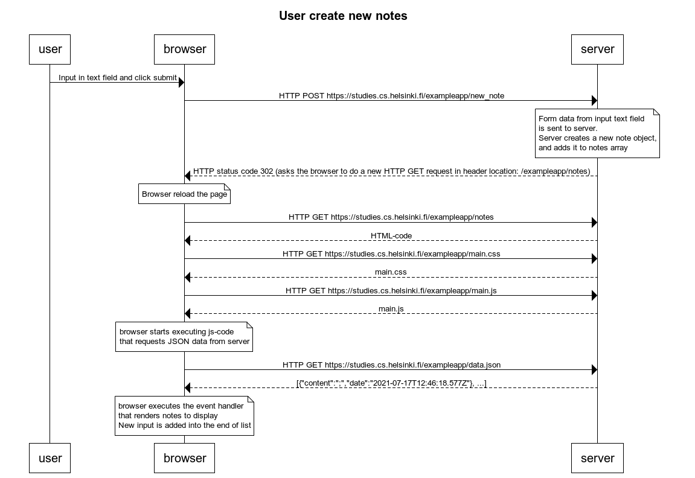
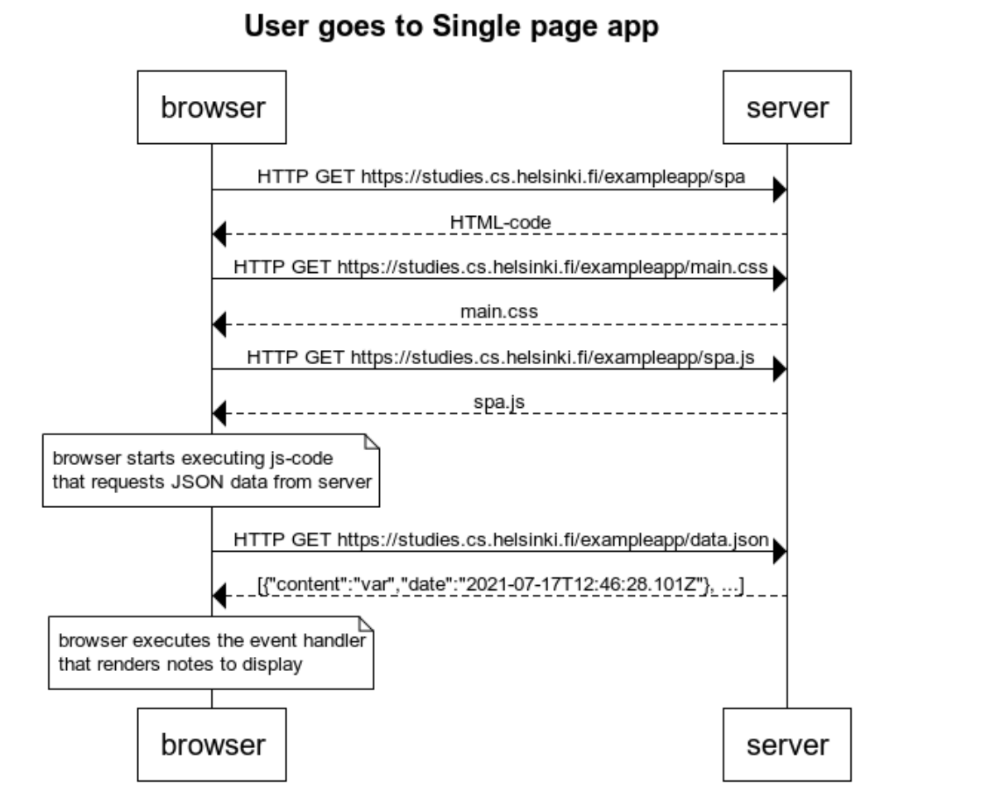
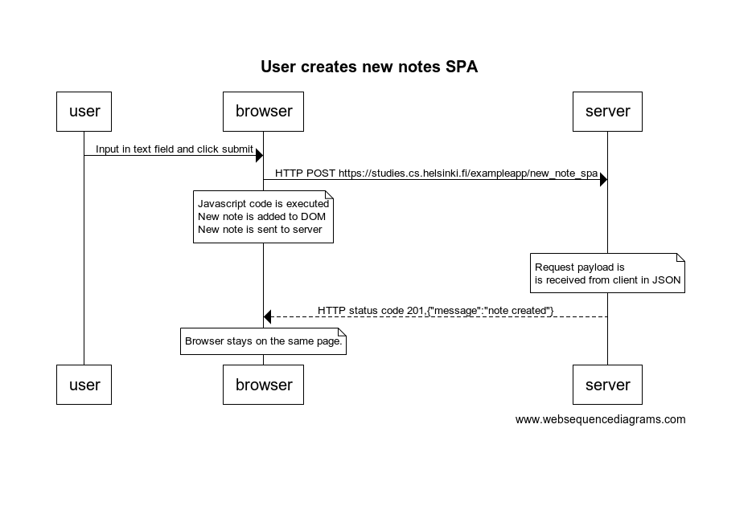

# Exercise 0.4: new note

```
title User creates new notes
user -> browser: Input in text field and click submit
browser -> server: HTTP POST https://studies.cs.helsinki.fi/exampleapp/new_note

note over server: 
Form data from input text field 
is sent to server.
Server creates a new note object, 
and adds it to notes array
end note

server --> browser: HTTP status code 302 (asks the browser to do a new HTTP GET request in header location: /exampleapp/notes)

note over browser:
Browser reload the page 
end note

browser -> server: HTTP GET https://studies.cs.helsinki.fi/exampleapp/notes
server --> browser: HTML-code
browser -> server: HTTP GET https://studies.cs.helsinki.fi/exampleapp/main.css
server-->browser: main.css
browser->server: HTTP GET https://studies.cs.helsinki.fi/exampleapp/main.js
server-->browser: main.js

note over browser:
browser starts executing js-code
that requests JSON data from server 
end note

browser->server: HTTP GET https://studies.cs.helsinki.fi/exampleapp/data.json
server-->browser: [{"content":";","date":"2021-07-17T12:46:18.577Z"}, ...]

note over browser:
browser executes the event handler
that renders notes to display
New input is added into the end of list
end note
```


# Exercise 0.5: Single page app

```
title User goes to Single page app
browser -> server: HTTP GET https://studies.cs.helsinki.fi/exampleapp/spa
server --> browser: HTML-code
browser -> server: HTTP GET https://studies.cs.helsinki.fi/exampleapp/main.css
server-->browser: main.css
browser->server: HTTP GET https://studies.cs.helsinki.fi/exampleapp/spa.js
server-->browser: spa.js

note over browser:
browser starts executing js-code
that requests JSON data from server 
end note

browser->server: HTTP GET https://studies.cs.helsinki.fi/exampleapp/data.json
server-->browser: [{"content":"var","date":"2021-07-17T12:46:28.101Z"}, ...]

note over browser:
browser executes the event handler
that renders notes to display
end note
```



# Exercise 0.6: New note

```
title User creates new notes SPA
user -> browser: Input in text field and click submit
browser -> server: HTTP POST https://studies.cs.helsinki.fi/exampleapp/new_note_spa

note over browser:
Javascript code is executed
New note is added to DOM
New note is sent to server
end note

note over server: 
Request payload is  
is received from client in JSON
end note

server --> browser: HTTP status code 201,{"message":"note created"}

note over browser: 
Browser stays on the same page.
end note
```




